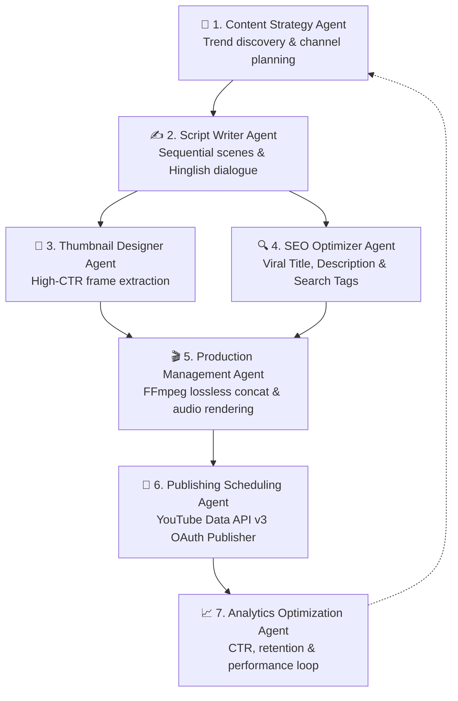

# 🎬 YouTube Automation Agent & Telegram Production Hub
### *Sameer | AgenticFlowAI — End-to-End Autonomous YouTube Channel Operator*

An enterprise-grade, autonomous YouTube automation suite featuring **7 specialized AI agents**, a **web dashboard & REST API**, and a **parallel non-blocking Telegram Bot** for daily hybrid content creation, manual video uploads, and automated fallback scheduling.

---

## 📌 Table of Contents
1. [System Architecture & 7 Dedicated Agents](#-system-architecture--7-dedicated-agents)
2. [Telegram Bot Integration (@Youtube_Automation_Agent_bot)](#-telegram-bot-integration)
   - [Interactive Keyboard & Controls](#interactive-keyboard--controls)
   - [Manual Upload Workflow (Shorts & Long Videos)](#1-manual-video-upload-workflow)
   - [10s VideoFX Prompt Generator & Memory Deduplication](#2-10-second-videofx-prompts--memory-deduplication)
   - [Completed: Lossless Merge & Direct Public Upload](#3-lossless-merge-seo--direct-public-publishing)
   - [Autonomous Fallback & 6:00 PM IST Streak Protector](#4-autonomous-ai-fallback--600-pm-ist-cron)
   - [Strict Privacy Policy Rules](#5-strict-privacy-policy-rules)
   - [View-Only Telegram Analysis Dashboards](#6-view-only-telegram-analysis-dashboards)
3. [Web Dashboard & REST API (Port 3456)](#-web-dashboard--rest-api-port-3456)
4. [Storage & Disk Auto-Cleanup Policy](#-storage--disk-auto-cleanup-policy)
5. [Process Management & PM2 Commands](#-process-management--pm2-commands)
6. [Environment Configuration (.env)](#-environment-configuration-env)
7. [Directory Structure](#-directory-structure)

---

## 🧠 System Architecture & 7 Dedicated Agents

The system orchestrates 7 autonomous AI agents running in synchronization:



1. **🧠 Content Strategy Agent:** Evaluates breakthrough AI, robotics, quantum computing, and tech news from web/research sources.
2. **✍️ Script Writer Agent:** Structures 40-second Shorts into 4 sequential 10-second scenes (Hook, Problem, Mechanism, Climax) with natural spoken Hinglish/English narration.
3. **🎨 Thumbnail Designer Agent:** Extracts optimal high-contrast frames at peak visual moments (`00:00:02`).
4. **🔍 SEO Optimizer Agent:** Crafts high-CTR titles (under 65 chars for Shorts with `#Shorts`, under 70 chars for Long videos), 3-paragraph keyword-rich descriptions, and 8-15 search tags.
5. **🎬 Production Management Agent:** Executes FFmpeg stream copy (lossless concat) or filter-complex conforming, preserving audio-video sync.
6. **🚀 Publishing Scheduling Agent:** Manages YouTube Data API v3 OAuth tokens, metadata normalization, synthetic media disclosures, and uploads.
7. **📈 Analytics Optimization Agent:** Monitors organic retention curves and CTR to continuously adapt future prompt hooks.

---

## 🤖 Telegram Bot Integration

**Bot Username:** `@Youtube_Automation_Agent_bot`  
**Service:** `utils/telegram-bot-service.js`  
**PM2 Process:** `youtube-telegram-bot` (Process ID 5)

The Telegram Bot is built on an **asynchronous non-blocking parallel event loop**. Heavy operations (FFmpeg encoding, Gemini AI prompt generation, YouTube uploads) execute asynchronously without blocking status queries, live logs, or incoming updates.

### Interactive Keyboard & Controls
```
┌─────────────────────────────────┬─────────────────────────────────┐
│       💡 Give Me Prompt         │       📤 Manual Upload          │
├─────────────────────────────────┼─────────────────────────────────┤
│   ✅ Completed - Merge & Upload │       📊 System Status          │
├─────────────────────────────────┼─────────────────────────────────┤
│     🎯 Strategy & Backlog       │     📈 Growth & Analytics       │
├─────────────────────────────────┼─────────────────────────────────┤
│     🤖 Operator Analysis        │     🩺 7 Agents Health          │
├─────────────────────────────────┼─────────────────────────────────┤
│   🤖 Fallback AI Video Now      │       📋 Live Logs              │
├─────────────────────────────────┴─────────────────────────────────┤
│                    🗑 Clear Current Draft                         │
└───────────────────────────────────────────────────────────────────┘
```

---

### 1. Manual Video Upload Workflow
Allows the channel operator to publish custom videos (Shorts or Long-form) directly to YouTube:
1. Tap **`[ 📤 Manual Upload ]`** (or `/manual`).
2. Send the video file (`.mp4` / `.mov`).
3. Send a text message describing the video and format:
   - Example 1: `Short: Mind-blowing AI humanoid robot demo`
   - Example 2: `Long video: Complete Python and Machine Learning Tutorial 2026`
4. The bot auto-detects `short` vs `long` from your message or the video aspect ratio/duration.
5. Tap **`[ ✅ Completed - Merge & Upload ]`**.
6. Gemini AI generates custom SEO metadata tailored to your description and video format.
7. Video is uploaded directly as **Public** to YouTube, samples are auto-cleaned, and the live link is sent to the chat.

---

### 2. 10-Second VideoFX Prompts & Memory Deduplication
- Tap **`[ 💡 Give Me Prompt ]`** (or send any custom topic / "Part 2").
- Generates 4 sequential 10-second scene prompts explicitly formatted for **9:16 vertical** (1080x1920) Google Gemini VideoFX.
- **Permanent History Memory (`data/topic_history.json`):** Tracks the last 200 published topics. The AI actively rejects past topics to guarantee **100% fresh, non-repetitive content**.

---

### 3. Lossless Merge, SEO & Direct Public Publishing
- **1 Video Uploaded:** Directly copied to output via FFmpeg stream copy (zero re-encoding loss, lightning fast).
- **Multiple Clips Uploaded:** Losslessly concatenated via FFmpeg demuxer (`-f concat -c copy`) with automatic fallback to filter concat if codec conformity is required.
- **Dynamic AI SEO Metadata:** Tailored Title, Description with hashtags, and search tags.
- **Thumbnail Extraction:** High-resolution thumbnail frame extracted at `00:00:02`.
- **Direct Public Publishing:** Published immediately as **Public** on the channel `Sameer | AgenticFlowAI`.

---

### 4. Autonomous AI Fallback & 6:00 PM IST Cron
- **Daily Cron (18:00 IST):** Scheduled every day at 6:00 PM IST (`0 18 * * *`).
- If no manual clips were uploaded today, the autonomous fallback pipeline triggers automatically:
  - Generates realistic visual short with AI voiceover and dynamic subtitles.
  - Ensures the channel's daily upload streak is maintained.
- **Manual Trigger:** Can also be triggered anytime via **`[ 🤖 Fallback AI Video Now ]`**.

---

### 5. Strict Privacy Policy Rules

| Source | Feature / Trigger | YouTube Visibility | Rationale |
| :--- | :--- | :--- | :--- |
| **Creator Content** | `[ 📤 Manual Upload ]` + `[ ✅ Completed ]` | **🌍 Public** | Approved user-provided content goes live immediately. |
| **Creator Clips** | Staged Clips + `[ ✅ Completed ]` | **🌍 Public** | Approved assembled clips go live immediately. |
| **Fallback AI Video** | `[ 🤖 Fallback AI Video Now ]` or 6:00 PM IST Cron | **🔒 Private** | Autonomous fallback uploads privately so the creator can review in YouTube Studio before making public. |

---

### 6. View-Only Telegram Analysis Dashboards
Provides direct real-time visibility into the backend systems (strictly **Read-Only / Analysis**, ensuring zero accidental modification of settings):

1. **🎯 Strategy & Backlog (`/strategy`, `/ideas`):**
   - Channel Identity (`Sameer | AgenticFlowAI`, Target Audience, Brand Voice).
   - Content Ideas Backlog and evaluation status.
   - Upcoming Publishing Queue.
   - Breakdown of how the Strategy and ScriptWriter agents operate.
2. **📈 Growth & Analytics (`/analytics`, `/growth`):**
   - Overall Performance Score (0-100).
   - Tracked and measured video counts.
   - Audience baselines: Impressions CTR, Average View Duration, Retention, and Engagement Rate.
   - AI Learning feedback loop explanation.
3. **🤖 Operator Analysis (`/operator`):**
   - Autonomous Operator execution state (Active vs Standby).
   - Automation pause/active status and server uptime.
   - Daily autonomous lifecycle overview.
   - Recent operator execution logs.
4. **🩺 7 Agents Health (`/health`, `/agents`):**
   - Real-time online status of all 7 agents (`Strategy`, `ScriptWriter`, `Thumbnail`, `SEO`, `Production`, `Publishing`, `Analytics`).
   - Database health and size.
   - Media engine and OAuth token verification.

---

## 🌐 Web Dashboard & REST API (Port 3456)

**Live Dashboard URL:** [http://161.97.80.178:3456](http://161.97.80.178:3456)  
**Service:** `index.js`  
**PM2 Process:** `youtube-automation-server` (Process ID 4)

### Web Dashboard Features
- **Pipeline & Review Panel:** Real-time generation job tracking, thumbnail inspection, scene-by-scene script review, and narration adjustment.
- **Channel Strategy & Ideas Backlog:** Visual idea cards and autonomous planning.
- **Analytics & Retention Charts:** Visual graphs for retention curves, CTR, and performance benchmarks.
- **Engagement & Comments:** YouTube comment monitoring and AI-assisted reply drafting.
- **Readiness Verification:** Automated checks for FFmpeg, OAuth tokens, and AI providers.

### Core API Endpoints
- `GET /api/dashboard` — Full JSON payload of all stats, agents, settings, and pipeline state.
- `GET /health` — Service health check and list of active agents.
- `GET /schedule` — Active publish queue and scheduled entries.
- `GET /analytics` — Real-time performance score and learning baselines.

---

## 🧹 Storage & Disk Auto-Cleanup Policy

To prevent disk overflow on VPS environments:
1. **Post-Upload Auto-Cleanup (`clearSamplesDir`):** Upon every successful YouTube upload (manual, merged, or fallback), temporary `.mp4` and `.jpg` files in `samples/` are **automatically deleted** from disk.
2. **Draft Clear (`clearDraft`):** Tapping `[ 🗑 Clear Current Draft ]` removes all staged files in `data/telegram_staging/` and temporary sample files, freeing up disk space immediately.

---

## 🚀 Process Management & PM2 Commands

Both services are daemonized under PM2 for automatic restart on server reboot:

```bash
# View running status
pm2 status

# Restart services
pm2 restart youtube-telegram-bot
pm2 restart youtube-automation-server

# Real-time logs
pm2 logs youtube-telegram-bot --lines 50
pm2 logs youtube-automation-server --lines 50

# Stop services
pm2 stop youtube-telegram-bot
pm2 stop youtube-automation-server
```

---

## ⚙️ Environment Configuration (.env)

Key variables required in `.env`:

```env
# Telegram Bot Configuration
TELEGRAM_BOT_TOKEN="your_telegram_bot_token"
TELEGRAM_FALLBACK_HOUR_IST=18
TIMEZONE="Asia/Kolkata"

# YouTube Publishing Defaults
DEFAULT_PRIVACY_STATUS="public"
YOUTUBE_CATEGORY_ID="28"

# AI Provider Keys
GEMINI_API_KEY="your_google_gemini_api_key"
OPENAI_API_KEY="your_openai_or_proxy_key"
OPENAI_BASE_URL="https://generativelanguage.googleapis.com/v1beta/openai/"
OPENAI_MODEL="gemini-3.6-flash"

# Server Port
PORT=3456
```

---

## 📁 Directory Structure

```
youtube_automation_agent/
├── agents/                           # 7 Autonomous AI Agents
│   ├── content-strategy-agent.js
│   ├── script-writer-agent.js
│   ├── thumbnail-designer-agent.js
│   ├── seo-optimizer-agent.js
│   ├── production-management-agent.js
│   ├── publishing-scheduling-agent.js
│   └── analytics-optimization-agent.js
├── config/                           # YouTube OAuth tokens & credentials
│   ├── credentials.json
│   └── tokens.json
├── dashboard/                        # Web Dashboard Frontend
│   ├── index.html
│   ├── app.js
│   ├── enhance.js
│   └── styles.css
├── data/                             # Persistent runtime data
│   ├── telegram_staging/             # Staged video clips & draft.json
│   ├── telegram_admin.json           # Authorized admin chat ID
│   ├── topic_history.json            # 200-topic deduplication memory
│   └── youtube_automation.db         # SQLite database
├── database/                         # SQLite Database schema & queries
├── samples/                          # Temporary render directory (auto-cleaned)
├── schedules/                        # Daily automation cron jobs
├── scripts/                          # Utility scripts & fallback generators
│   └── generate-realistic-short.js
├── utils/                            # Core service modules
│   ├── telegram-bot-service.js       # Telegram Automation Service
│   ├── ffmpeg.js                     # FFmpeg execution wrapper
│   ├── logger.js                     # Ring-buffer logging
│   └── credential-manager.js         # OAuth credential validation
├── index.js                          # Main Server & REST API (Port 3456)
├── package.json
└── README.md                         # Comprehensive System Documentation
```

---

## 🏆 Summary of Recent Enhancements

- ✅ **Parallel Non-Blocking Telegram Loop:** Asynchronous update queue preventing bot lockups.
- ✅ **YouTube Upload Pipeline Fix:** Complete metadata alignment (`metadata.seo`, `metadata.video.path`) enabling live publishing to `Sameer | AgenticFlowAI`.
- ✅ **Dynamic Manual Upload Mode:** Full support for both Shorts (9:16) and Long videos (16:9) with automatic format detection.
- ✅ **Privacy Policy Differentiation:** Manual & merged clips upload as **`public`**; AI fallback videos upload as **`private`**.
- ✅ **Automated Disk Cleanup:** Automatic post-upload purging of temporary video samples.
- ✅ **View-Only Analysis Dashboards:** Real-time Telegram views for Strategy & Backlog, Growth Analytics, Operator Analysis, and 7 Agents Health.
- ✅ **Permanent Deduplication Memory:** 200-topic JSON history memory preventing repeated concepts.
